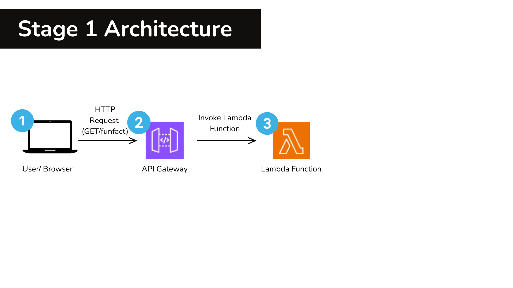

# ☁️AWS Cloud Fun Facts Generator

A tiny serverless app: API Gateway → Lambda returns a random AWS fun fact.

## 🧠 How it works 
API Gateway exposes an HTTP endpoint. When you call it, a Lambda function runs and returns a fun fact as JSON. Logs go to CloudWatch. (If I add DynamoDB later, it will store facts there.)

## 🚀 Run it (simple)
1) Deploy the Lambda + API (follow steps in this repo).
2) Test with curl or your browser using the API Gateway URL.

## 🏗️ Architecture 


# 🟨Stage 1- Lambda + API Gateway Integration
This stage connects the Lambda to an API Gateway endpoint  and validates that it returns  data successfully.

## 🔧 Proof of Stage 1 (console screenshots)
- Lambda Config: 
- Lambda Code: 
- Lambda Test: 
- API Gateway: 
- API Gateway Routes: 
- API Stage : 
- API Test:

## 🧩What I learned
- How to connect API Gateway to Lambda and a deploy a working endpoint.
- How to test an API Invoke URL.
- Practiced secure documentation by redacting sensitive ARNs.
---
# ☁️ AWS Cloud Fun Facts Generator

A tiny serverless app: API Gateway → Lambda returns a random AWS fun fact.

## 🧠 How it works 
API Gateway exposes an HTTP endpoint. When you call it, a Lambda function runs and returns a fun fact as JSON. Logs go to CloudWatch. (If I add DynamoDB later, it will store facts there.)

## 🚀 Run it (simple)
1) Deploy the Lambda + API (follow steps in this repo).
2) Test with curl or your browser using the API Gateway URL.

## 🏗️ Architecture 


# 🟨 Stage 1 – Lambda + API Gateway Integration
This stage connects the Lambda to an API Gateway endpoint and validates that it returns data successfully.

## 🔧 Proof of Stage 1 (console screenshots)
- Lambda Config: 
- Lambda Code: 
- Lambda Test: 
- API Gateway: 
- API Gateway Routes: 
- API Stage: 
- API Test: 

## 🧩 What I learned
- How to connect API Gateway to Lambda and deploy a working endpoint.
- How to test an API Invoke URL.
- Practiced secure documentation by redacting sensitive ARNs.

# ☁️ AWS Cloud Fun Facts Generator

A tiny serverless app: API Gateway → Lambda returns a random AWS fun fact.

## 🧠 How it works 
API Gateway exposes an HTTP endpoint. When you call it, a Lambda function runs and returns a fun fact as JSON. Logs go to CloudWatch. (If I add DynamoDB later, it will store facts there.)

## 🚀 Run it (simple)
1) Deploy the Lambda + API (follow steps in this repo).
2) Test with curl or your browser using the API Gateway URL.

## 🏗️ Architecture 


# 🟨 Stage 1 – Lambda + API Gateway Integration
This stage connects the Lambda to an API Gateway endpoint and validates that it returns data successfully.

## 🔧 Proof of Stage 1 (console screenshots)
- Lambda Config: 
- Lambda Code: 
- Lambda Test: 
- API Gateway: 
- API Gateway Routes: 
- API Stage: 
- API Test: 

## 🧩 What I learned
- How to connect API Gateway to Lambda and deploy a working endpoint.
- How to test an API Invoke URL.
- Practiced secure documentation by redacting sensitive ARNs.

---

# 🟩 Stage 2 – Lambda + DynamoDB Integration
The app evolved — now powered by **API Gateway → Lambda → DynamoDB** to fetch AWS fun facts dynamically.  

## 🧠 How it works 
API Gateway exposes an HTTP endpoint.  
When you call it, Lambda queries the DynamoDB table `CloudFacts`, randomly selects a fact, and returns it as JSON.  
Logs are stored in CloudWatch for visibility.  
✅ The endpoint now successfully returns a random AWS fun fact from DynamoDB.

## 🚀 Run it (simple)
1) Deploy the Lambda, attach the DynamoDB read policy, and create the API Gateway endpoint.  
2) Test using curl or your browser with the Invoke URL.  

## 🏗️ Architecture 


## 🔧 Proof of Stage 2 (console screenshots)
- DynamoDB Create Table: 
- Table Created Successfully: 
- Create Item (Fun Fact): 
- Verify Items List: 
- IAM Policy Attached (AmazonDynamoDBReadOnlyAccess): 
- Lambda Code Updated for DynamoDB Access: 
- Lambda Test Success (Response Returned): 
- API Endpoint Created: 
- API Test Output (Fun Fact Works!): 

## 🧩 Example Output
```json
{"fact": "EC2 was one of the first AWS services to change IT forever."}

# 🧩 What I learned
- How to integrate **Lambda + DynamoDB** to make APIs dynamic and data-driven.  
- How to attach **IAM roles and policies** securely to control Lambda permissions.  
- How to test a full **end-to-end flow**: API Gateway → Lambda → DynamoDB → JSON response.  
- Gained hands-on experience with **boto3** and how Lambda interacts with AWS services.  
- Improved my skills in **architectural diagram design** using Canva to visualize AWS components.  
- Practiced good documentation habits by redacting sensitive information and structuring clear proofs of progress.  
- Confirmed that the **live API endpoint** successfully returns random fun facts from DynamoDB 🎉  
