# ☁️AWS Cloud Fun Facts Generator

A tiny serverless app: API Gateway → Lambda returns a random AWS fun fact.

## 🧠 How it works 
API Gateway exposes an HTTP endpoint. When you call it, a Lambda function runs and returns a fun fact as JSON. Logs go to CloudWatch. (If I add DynamoDB later, it will store facts there.)

## 🚀 Run it (simple)
1) Deploy the Lambda + API (follow steps in this repo).
2) Test with curl or your browser using the API Gateway URL.

## 🏗️ Architecture 
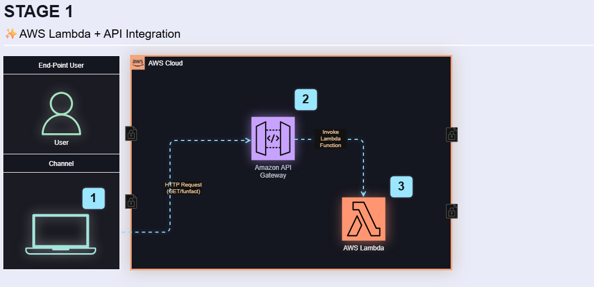

# 🟨Stage 1- Lambda + API Gateway Integration
This stage connects the Lambda to an API Gateway endpoint  and validates that it returns  data successfully.

## 🔧 Proof of Stage 1 (console screenshots)
- Lambda Config: 
- Lambda Code: 
- Lambda Test: 
- API Gateway: 
- API Gateway Routes: 
- API Stage : 
- API Test:

## 🧩What I learned
- How to connect API Gateway to Lambda and a deploy a working endpoint.
- How to test an API Invoke URL.
- Practiced secure documentation by redacting sensitive ARNs.

# 🟩 Stage 2 – Lambda + DynamoDB Integration  
This stage connects the Lambda function to a DynamoDB table so fun facts can be stored and retrieved dynamically instead of being hardcoded.

## 🧠 How it works  
API Gateway exposes an HTTP endpoint.  
When you call it, Lambda queries the DynamoDB table `CloudFacts`, randomly selects a fact, and returns it as JSON.  
✅ The endpoint now successfully returns a random AWS fun fact from DynamoDB.

## 🚀 Run it (simple)
1. Create a DynamoDB table named **CloudFacts** with `FactID` as the partition key.  
2. Add fun facts as items (`FactText` attribute).  
3. Attach the **AmazonDynamoDBReadOnlyAccess** policy to your Lambda’s IAM role.  
4. Update the Lambda code to query DynamoDB using **boto3**.  
5. Deploy and test with the API Gateway invoke URL in your browser.

## 🏗️ Architecture  

## 🔧 Proof of Stage 2 (console screenshots)
- DynamoDB Create Table: 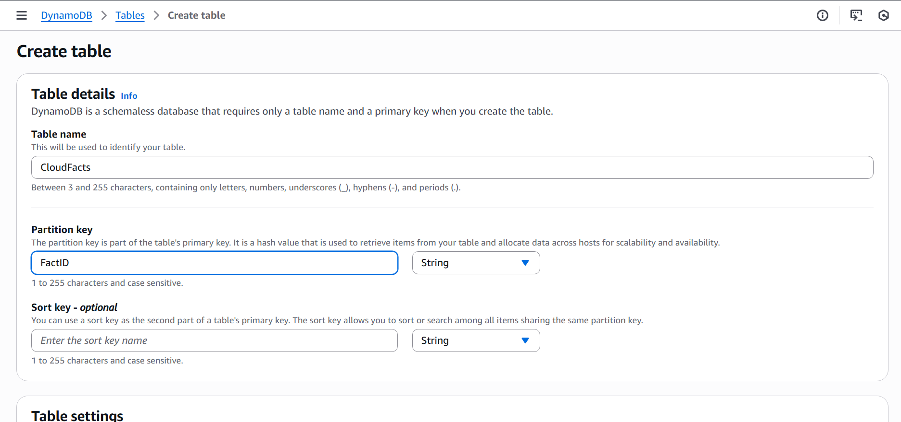  
- Table Created Successfully: 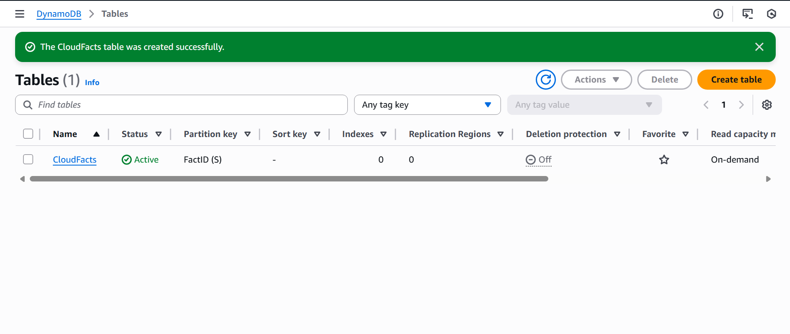  
- Create Item (Fun Fact): 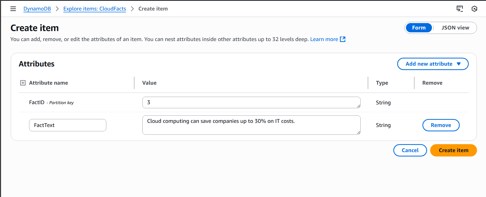  
- Verify Items List: 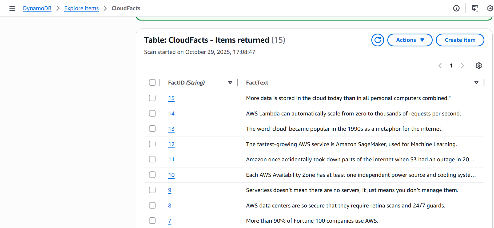  
- IAM Policy Attached (AmazonDynamoDBReadOnlyAccess): 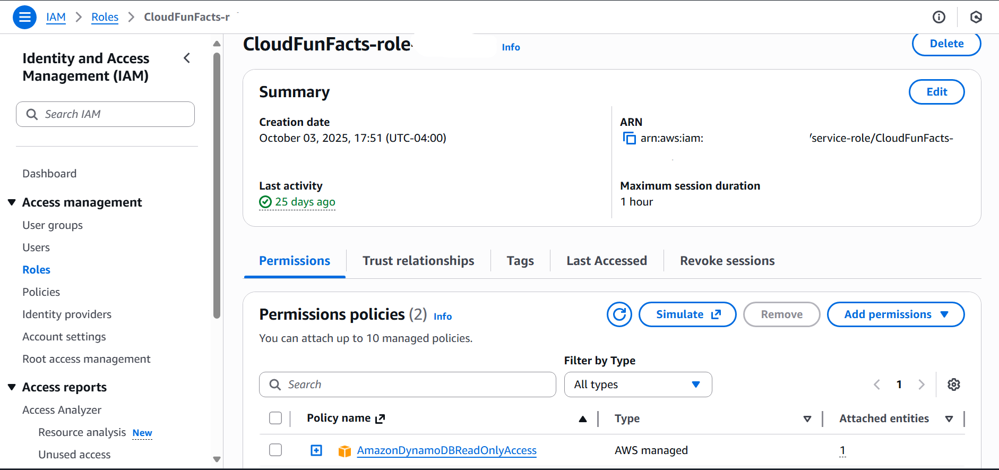  
- Lambda Code Updated for DynamoDB Access: 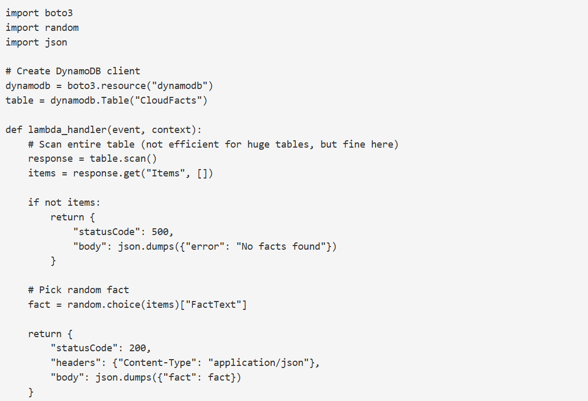  
- Lambda Test Success (Response Returned): 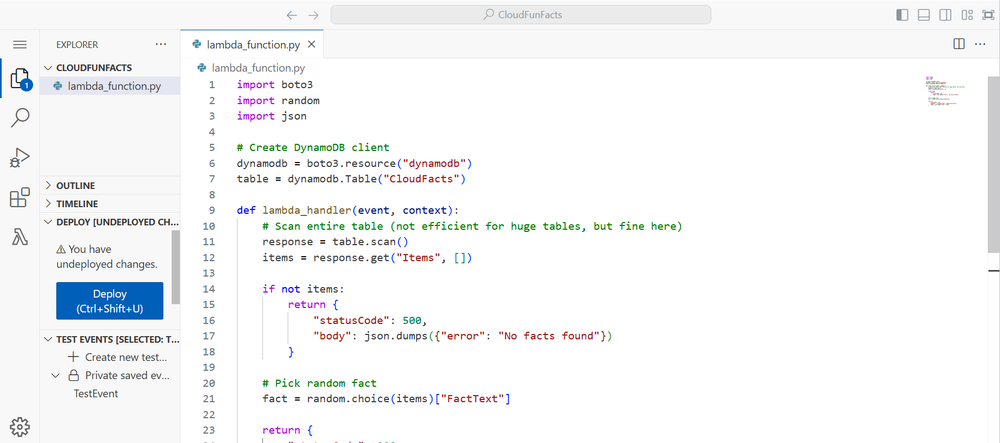  
- API Endpoint Created:   
- API Test Output (Fun Fact Works!): 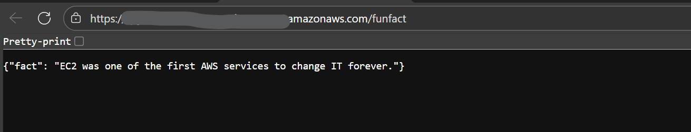  
 

## 🧩 What I learned
- How to integrate Lambda + DynamoDB to make APIs dynamic and data-driven.  
- How to attach IAM roles and policies securely to control Lambda permissions.  
- How to test a complete end-to-end flow: API Gateway → Lambda → DynamoDB → JSON response.  
- Hands-on practice with boto3 for AWS service interaction.  
- Strengthened architecture design skills using Canva for AWS visualization.  
- Practiced redacting sensitive info and structuring clear documentation.  
- Verified that the live API endpoint successfully returns random fun facts from DynamoDB 🎉

---

## 🧠 Stage 3 — Amazon Bedrock Integration

In this stage, I integrated **Amazon Bedrock** into the CloudFunFacts application to generate dynamic, AI-powered witty facts.  
This extended the existing Lambda + API Gateway workflow by adding Gen-AI capabilities through the **Claude 3.5 Sonnet** model by Anthropic.

---

### 🧩 Step 1 — Select the Bedrock Model

I navigated to **Amazon Bedrock → Model Catalog**, filtered by **Provider: Anthropic**, and selected **Claude 3.5 Sonnet** for this project.  
Since it was my first time using Bedrock, I submitted a use-case request and was approved.

---

### 🔐 Step 2 — Grant Lambda Bedrock Access

Opened the **IAM Console → Roles**, searched for my Lambda execution role `CloudFunFacts-role`,  
and attached the **AmazonBedrockFullAccess** managed policy.  
This allowed the Lambda function to call Bedrock’s runtime APIs.

---

### 💻 Step 3 — Update Lambda Function Code

The Lambda function was updated to:  
- Fetch random facts from DynamoDB  
- Pass the data to the Bedrock client (`boto3.client("bedrock-runtime")`)  
- Return a witty, AI-generated fact through API Gateway  

---

### ⚙️ Step 4 — Adjust Lambda Configuration

Under **Configuration → Edit Basic Settings**, I increased the **timeout** value to **30 seconds**  
to ensure sufficient time for Bedrock responses.

---

### 🧪 Step 5 — Test the Gen-AI Lambda

After deployment, I ran a test event named **TestEvent**.  
The output confirmed a successful Bedrock-powered response with a witty cloud fact.

---

### 🌐 Step 6 — Validate via API Gateway Endpoint

Reused the existing API Gateway endpoint created in Stage 2.  
Opened the URL in the browser and confirmed a live Bedrock-generated fact displayed in JSON format.

---

## 🧾 Proof of Stage 3 (console screenshots)

- Bedrock Model Catalog (Anthropic Models): 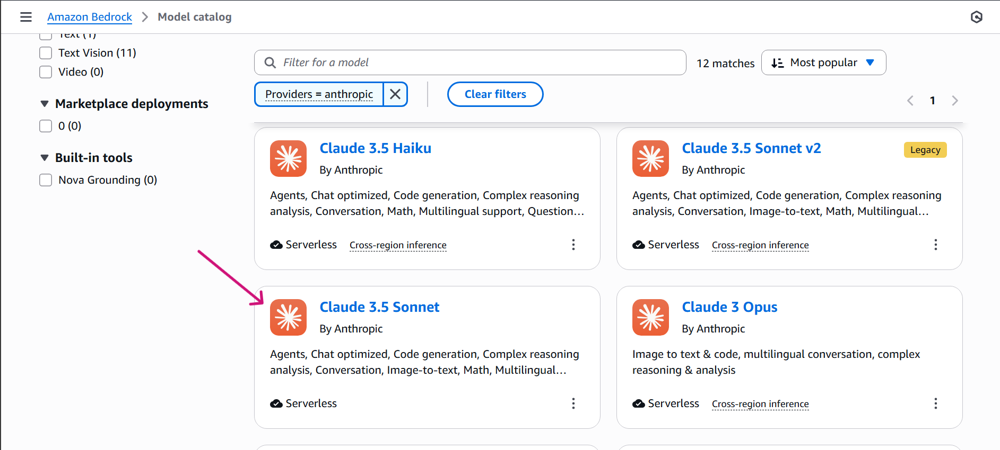
- Selected Claude 3.5 Sonnet: 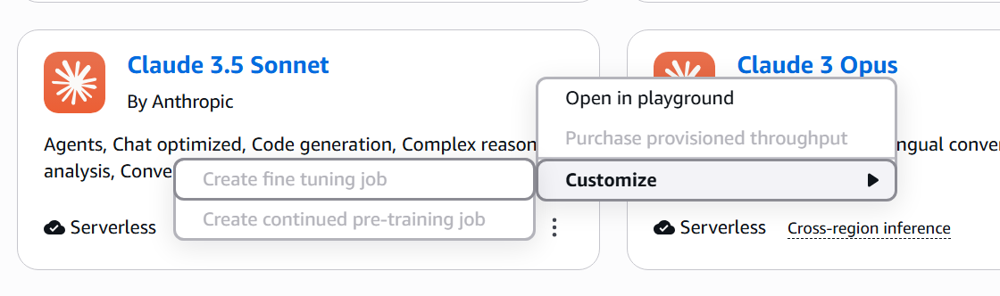
- IAM Role Attached (AmazonBedrockFullAccess): 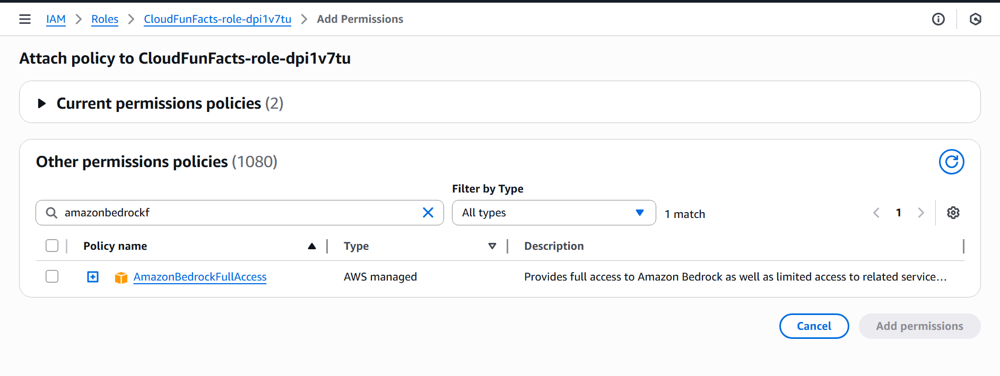
- Lambda Updated with Bedrock Code (Part 1): 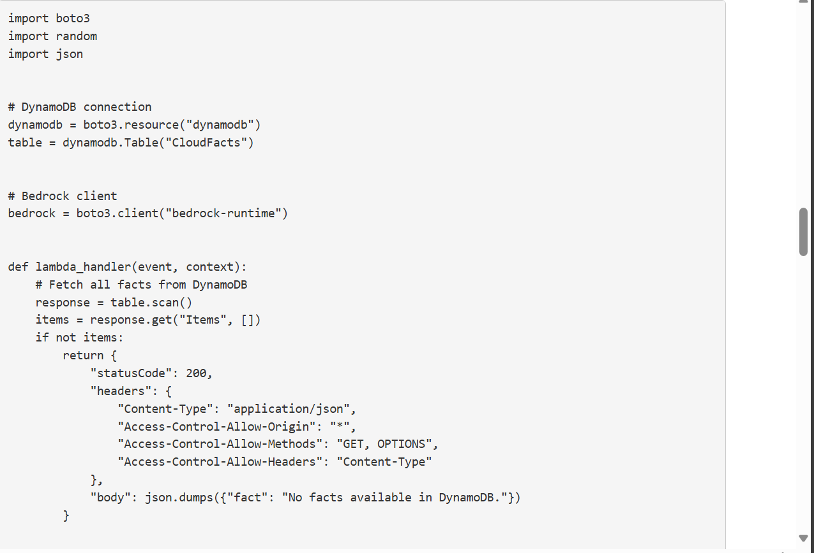
- Lambda Updated with Bedrock Code (Part 2): 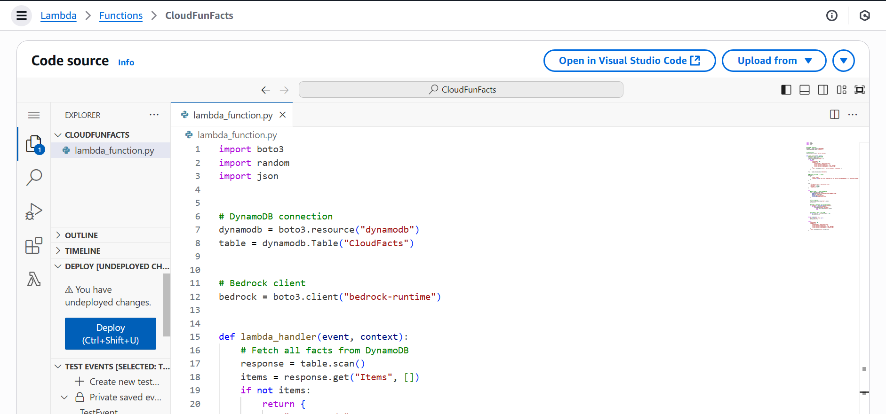
- Lambda Timeout Increased to 30s: 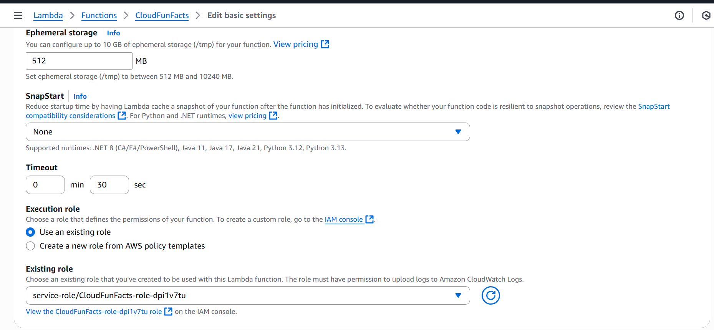
- Lambda Test Success (AI Response Returned): 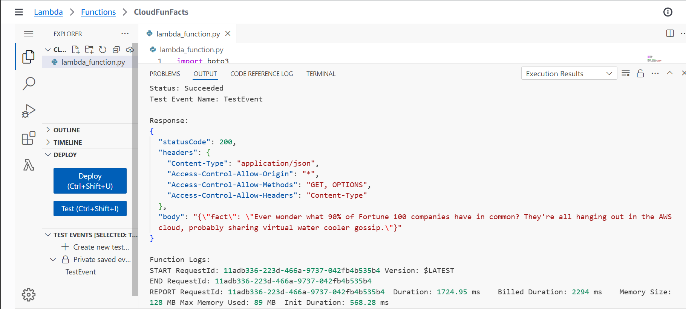
- API Endpoint Verified: 
- API Output (Witty Fact from Bedrock): 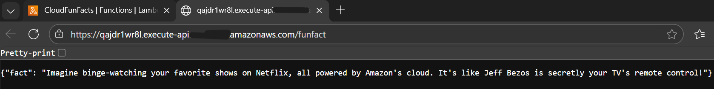

---

### ✅ Outcome

At this stage, the **CloudFunFacts** architecture successfully connects:

1. **Amplify** (Frontend Hosting)  
2. **API Gateway**  
3. **Lambda Function**  
4. **DynamoDB**  
5. **Amazon Bedrock (AI Model Invocation)**  

The system now returns fun, dynamically generated cloud facts powered by real-time AI inference.

---

### 🧭 What I Learned

- How to configure and invoke **Amazon Bedrock models** using Python (`boto3`)  
- How to attach IAM policies for Bedrock access safely and securely  
- How to manage Lambda runtime performance and timeouts  
- How serverless AI pipelines (DynamoDB + Lambda + Bedrock) can automate intelligent content generation  

---

