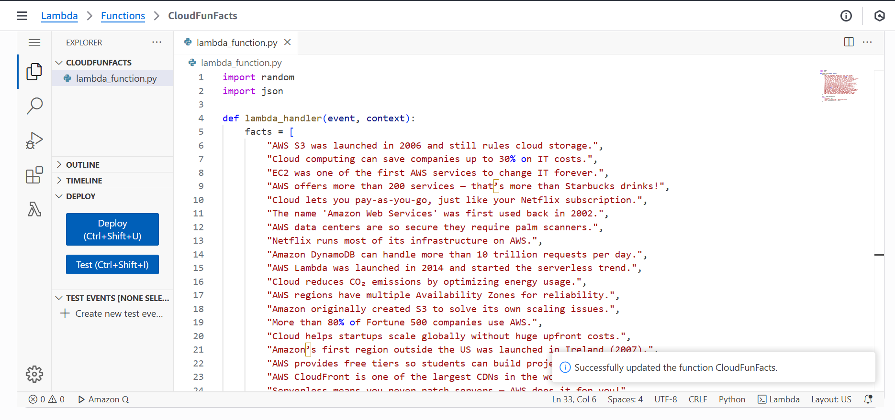

# AWS Cloud Fun Facts Generator

A tiny serverless app: API Gateway → Lambda returns a random AWS fun fact.

## How it works (1 paragraph)
API Gateway exposes an HTTP endpoint. When you call it, a Lambda function runs and returns a fun fact as JSON. Logs go to CloudWatch. (If I add DynamoDB later, it will store facts there.)

## Run it (simple)
1) Deploy the Lambda + API (follow steps in this repo).
2) Test with curl or your browser using the API Gateway URL.

## Architecture (picture)

## Proof (console screenshots)
- Lambda config: 
- Lambda code: 
- API routes: 
- API stage URL: 
- Logs success: 

## What I learned
- Wiring API Gateway to Lambda
- Using CloudWatch Logs to debug
- Keeping IAM least-privilege
