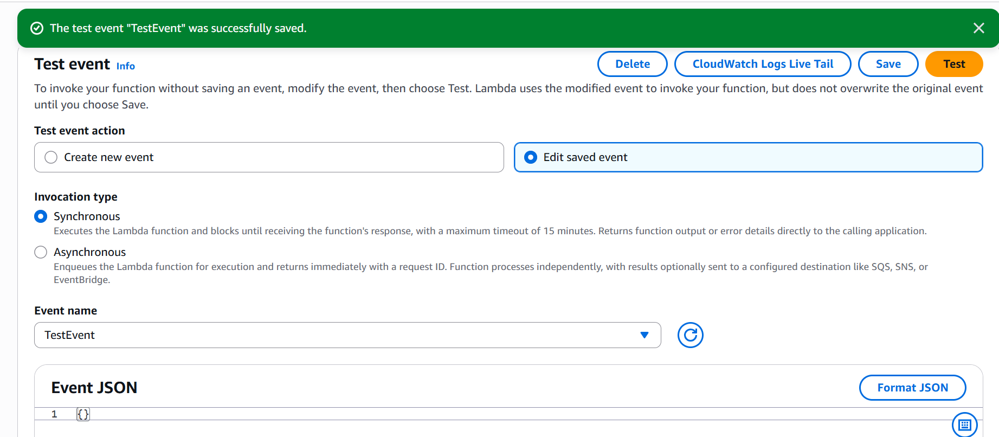

# ☁️AWS Cloud Fun Facts Generator

A tiny serverless app: API Gateway → Lambda returns a random AWS fun fact.

## 🧠 How it works 
API Gateway exposes an HTTP endpoint. When you call it, a Lambda function runs and returns a fun fact as JSON. Logs go to CloudWatch. (If I add DynamoDB later, it will store facts there.)

## 🚀 Run it (simple)
1) Deploy the Lambda + API (follow steps in this repo).
2) Test with curl or your browser using the API Gateway URL.

## 🏗️ Architecture 


# 🟨Stage 1- Lambda + API Gateway Integration
This stage connects the Lambda to an API Gateway endpoint  and validates that it returns  data successfully.

## 🔧 Proof of Stage 1 (console screenshots)
- Lambda Config: 
- Lambda Code: 
- Lambda Test: 
- API Gateway: 
- API Gateway Routes: 
- API Stage : 
- API Test:

## 🧩What I learned
- How to connect API Gateway to Lambda and a deploy a working endpoint.
- How to test an API Invoke URL.
- Practiced secure documentation by redacting sensitive ARNs.

# 🟩 Stage 2 – Lambda + DynamoDB Integration  
This stage connects the Lambda function to a DynamoDB table so fun facts can be stored and retrieved dynamically instead of being hardcoded.

## 🧠 How it works  
API Gateway exposes an HTTP endpoint.  
When you call it, Lambda queries the DynamoDB table `CloudFacts`, randomly selects a fact, and returns it as JSON.  
✅ The endpoint now successfully returns a random AWS fun fact from DynamoDB.

## 🚀 Run it (simple)
1. Create a DynamoDB table named **CloudFacts** with `FactID` as the partition key.  
2. Add fun facts as items (`FactText` attribute).  
3. Attach the **AmazonDynamoDBReadOnlyAccess** policy to your Lambda’s IAM role.  
4. Update the Lambda code to query DynamoDB using **boto3**.  
5. Deploy and test with the API Gateway invoke URL in your browser.

## 🏗️ Architecture  


## 🔧 Proof of Stage 2 (console screenshots)
- DynamoDB Create Table:   
- Table Created Successfully:   
- Create Item (Fun Fact):   
- Verify Items List:   
- IAM Policy Attached (AmazonDynamoDBReadOnlyAccess):   
- Lambda Code Updated for DynamoDB Access:   
- Lambda Test Success (Response Returned):   
- API Endpoint Created:   
- API Test Output (Fun Fact Works!):   
 


## 🧩 What I learned
- How to integrate Lambda + DynamoDB to make APIs dynamic and data-driven.  
- How to attach IAM roles and policies securely to control Lambda permissions.  
- How to test a complete end-to-end flow: API Gateway → Lambda → DynamoDB → JSON response.  
- Hands-on practice with boto3 for AWS service interaction.  
- Strengthened architecture design skills using Canva for AWS visualization.  
- Practiced redacting sensitive info and structuring clear documentation.  
- Verified that the live API endpoint successfully returns random fun facts from DynamoDB 🎉

---

## 🟥 Stage 3 — Amazon Bedrock Integration

In this stage, I integrated **Amazon Bedrock** into the CloudFunFacts application to generate dynamic, AI-powered witty facts.  
This extended the existing Lambda + API Gateway workflow by adding Gen-AI capabilities through the **Claude 3.5 Sonnet** model by Anthropic.

## 💭 How it works
API Gateway keeps the same `/funfact` endpoint. When you call it, Lambda can fetch or build a prompt and send it to **Amazon Bedrock (Claude 3.5 Sonnet)**, then returns a witty AI-generated fact as JSON.  
✅ The endpoint now successfully returns dynamic fun facts powered by Bedrock.

## 🚀 Run it (simple)
1) Open **Amazon Bedrock → Model Catalog**.  
2) Filter by **Provider: Anthropic** and select **Claude 3.5 Sonnet**.  
3) In **IAM → Roles**, attach **AmazonBedrockFullAccess** to your Lambda execution role (`CloudFunFacts-role`).  
4) Update the Lambda code to include a Bedrock client and prompt call:
   ```python
   import boto3
   bedrock = boto3.client("bedrock-runtime")  # Claude via Bedrock

5) Increase Lambda timeout under Configuration → Edit basic settings to 30 seconds
6) Deploy and test the function with TestEvent to confirm a successful AI response.
7) Reuse the same API Gateway endpoint from Stage 2 and open it in the browser.

---
## 🧾 Proof of Stage 3 (console screenshots)

- Bedrock Model Catalog (Anthropic Models): 
- Selected Claude 3.5 Sonnet: 
- IAM Role Attached (AmazonBedrockFullAccess): 
- Lambda Updated with Bedrock Code (Part 1): 
- Lambda Updated with Bedrock Code (Part 2): 
- Lambda Timeout Increased to 30s: 
- Lambda Test Success (AI Response Returned): 
- API Endpoint Verified: 
- API Output (Witty Fact from Bedrock): 

---

### 🧭 What I Learned

- How to configure and invoke **Amazon Bedrock models** using Python (`boto3`)  
- How to attach IAM policies for Bedrock access safely and securely  
- How to manage Lambda runtime performance and timeouts  
- How serverless AI pipelines (DynamoDB + Lambda + Bedrock) can automate intelligent content generation  

---
# 🟪 Stage 4 – Frontend with AWS Amplify

This stage adds a lightweight web UI (single `index.html`) hosted on **AWS Amplify** that calls your existing API Gateway → Lambda → (DynamoDB / Bedrock) backend and renders a fun fact.

## 💡 How it works
- A static HTML page (no build tools) is deployed to **Amplify Hosting**.
- The page calls your API with `fetch(API_URL)` and displays the JSON `{ "fact": "..." }`.
- **CORS** is enabled on API Gateway so the browser is allowed to call the API from your Amplify domain.

## 🚀 Run it (simple)

1. **Create `index.html`** (the only file).  
   - Include your **Invoke URL + `/funfact`** in the constant:
     ```js
     // Replace with your API invoke URL + /funfact
     const API_URL = 'https://<your-id>.execute-api.<region>.amazonaws.com/funfact';
     ```
   - Use a simple `fetch(API_URL)` to display `data.fact`.

2. **Enable CORS** in API Gateway:
   - Add your Amplify domain as an **Allowed Origin** (e.g., `https://production.<hash>.amplifyapp.com`).
   - Allow headers: `content-type`, `authorization`, `x-amz-date`, `x-api-key`, `x-amz-security-token`.
   - Allow methods: `GET, POST, OPTIONS, PUT, DELETE` (at least `GET` and `OPTIONS`).
   - Click **Deploy** after configuring CORS.

3. **Deploy the frontend to Amplify (no Git)**:
   - Amplify Console → **Create new app** → **Deploy without Git**.
   - App name (e.g., `cloud-fun-facts-generator`), branch `production`.
   - **Drag & drop** a zip that contains your **`index.html` at the top level** (zip the file itself, not a folder).

4. **Open the Amplify URL** and click **Generate Fun Fact**.  
   You should see a witty cloud fact returned from your backend.

---

## 🔧 Architecture
*(Optional) If you created a Stage 4 diagram, add it here.*  
For now, Stage 4 reuses your Stage 3 backend; the only addition is **Amplify Hosting** in front of API Gateway.

---

## 🧪 Proof of Stage 4 (console screenshots)

- Frontend Code (`index.html`):  
  

- API URL wired in code:  
  

- API Gateway → CORS (before configure):  
  

- API Gateway → CORS configured (origins/headers/methods):  
  

- Amplify → Create app (Deploy without Git):  
  

- Amplify → Manual deployment form:  
  

- Amplify → `index.zip` uploaded:  
  

- Frontend page (loaded):  
  

- Frontend success (fact rendered):  
  

---

## ✅ What I learned
- How to host a **single-file frontend** on **AWS Amplify** without any build system.
- How to correctly set **CORS** for browser → API Gateway calls (Allowed Origins, Headers, Methods).
- How to wire a **public Invoke URL** into client-side JavaScript safely (no secrets on the client).
- Practical debugging steps for 4xx/5xx: check **CORS**, **stage deployment**, and **route path** (`/funfact`).
- End-to-end validation: Amplify (UI) → API Gateway → Lambda → Bedrock/DynamoDB → JSON → UI.

---


